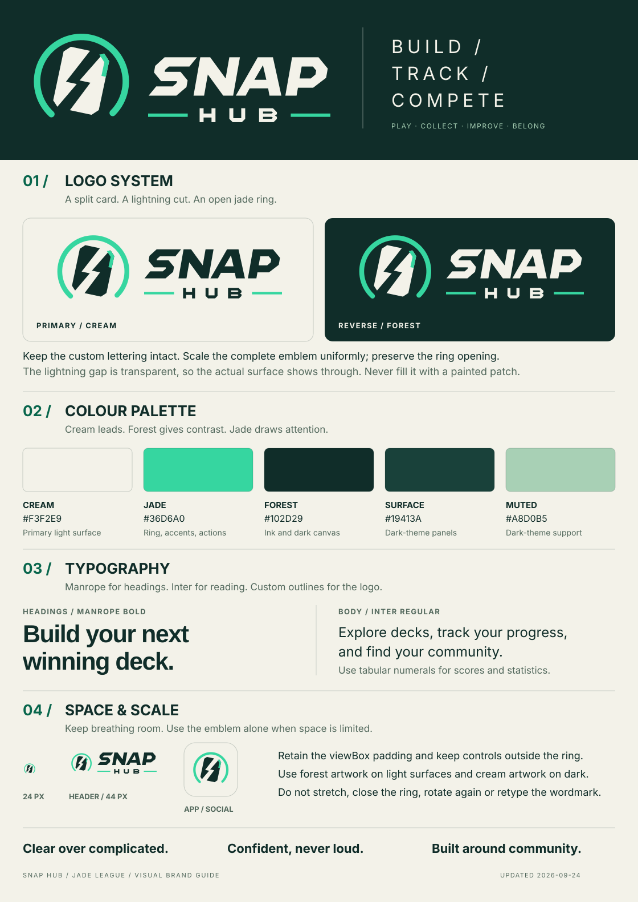

# Snap Hub brand guide

Current identity, approved September 24, 2026.



[Open the full-size visual guide](brand-guide.svg). It is generated from the same vector paths as the website.

Snap Hub uses an angular split-card emblem inside an open jade ring, paired with its custom SNAP/HUB wordmark.
The lightning-shaped cut through the card is transparent, letting the surrounding surface show through.
This combines the approved split-card direction with the approved ring. It replaces the earlier hand-and-card emblem.

The original [raster brand sheet](brand-sheet.png) remains a record of the earlier identity. Use this guide and the
generated SVG exports for current work.

## Logo system

| Asset | Use |
| --- | --- |
| [Light-surface emblem](../public/brand/emblem.svg) | Forest card and jade ring on cream or another light surface. |
| [Dark-surface emblem](../public/brand/emblem-dark.svg) | Cream card and jade ring on forest or another dark surface. |
| [Custom wordmark](../public/brand/wordmark.svg) | Forest SNAP/HUB outlines with jade dividers on light surfaces. |
| [App icon](../src/app/icon.svg) | The emblem in its app/favicon tile. |

Use the existing `BrandLogo` component for the website header. It joins the emblem and wordmark with the established
spacing and adapts their foregrounds to the selected theme. Use `BrandGlyph` for the standalone emblem and generated
share or app artwork. At small icon sizes, use the emblem alone.

Preserve the emblem's angle, ring opening, card corners, jade accent and transparent lightning cut. Scale uniformly
and retain the SVG viewBox padding. Keep adjacent text and controls outside the ring. The artwork should remain
recognizable at header and favicon sizes.

The custom wordmark is unchanged by the emblem update. Preserve the angular SNAP outlines, centered HUB line,
letter spacing, skew and jade dividers as one composition. Its geometry is defined by `WORDMARK`; use those paths
instead of recreating the logo with a font. UI typography is a separate system.

## Colour and themes

| Core colour | Hex | Role |
| --- | --- | --- |
| Jade | `#36D6A0` | Ring, emblem accent, dividers and filled actions. |
| Forest | `#102D29` | Light-theme text and emblem; dark-theme page background. |
| Cream | `#F3F2E9` | Light-theme page background; dark-theme text and emblem. |

The original support colours, forest surface `#19413A` and muted green `#A8D0B5`, are used in the dark palette.
The light palette uses pale surfaces and darker secondary text. The complete current values live in
[`src/app/globals.css`](../src/app/globals.css), including separate colours for ranks, charts, gains and losses.

In site components, use semantic tokens such as `bg`, `surface`, `ink`, `muted` and `accent` so both themes remain
readable. The light theme's text/link accent is a darker green (`#08664C`); the bright jade brand colour remains
available as `jade`. Filled jade actions use forest text. Keep statistics and error/success colours distinct from
decorative brand accents.

The site follows the device's light/dark preference until the visitor makes a choice. The header toggle saves that
choice under `snaphub:theme`, and the inline bootstrap applies it before the page paints. Standalone SVG files have
fixed colours; choose the export suited to the receiving surface. Both emblem exports keep the lightning gap transparent.

## Typography and voice

- **Headings:** Manrope, bold or extra bold as the page hierarchy requires.
- **Body and controls:** Inter, with weight and size appropriate to the content.
- **Data:** tabular numerals for aligned scores, counts and rates.
- **Wordmark:** the existing custom vector lettering; it is not a Manrope or Inter text treatment.

The brand language is “Build. Track. Compete.” and “Play. Collect. Improve. Belong.” Keep copy clear, useful and
focused on players. Cream creates space, forest gives text weight, and jade draws attention to a useful action.

## Motion and layout

Keep pointer tilt on featured artwork and preserve the reading position of statistics and effect text. Reset
motion on pointer exit or cancellation, support touch without requiring hover, and respect reduced-motion settings.
Use the responsive hero layout; its decorative emblem panel stays hidden below the medium breakpoint.

Check keyboard focus, small-screen layouts and both themes when changing shared brand components. Verify the
emblem's transparent cut on cream, forest and an additional coloured surface when changing its geometry.

## Source and exports

[`src/lib/brand.ts`](../src/lib/brand.ts) owns the palette constants and vector geometry.
[`src/components/brand.tsx`](../src/components/brand.tsx) renders the website logo and emblem. Generate exports from
the shared source at the repository root:

```sh
node scripts/build-brand.mjs
```

The script updates `public/brand/emblem.svg`, `public/brand/emblem-dark.svg`, `public/brand/wordmark.svg`,
`src/app/icon.svg` and the current visual sheet, `brand/brand-guide.svg`. The Apple icon and home Open Graph preview render from the shared brand components.
Review those outputs after changes and keep the existing wordmark paths intact when editing the emblem.
